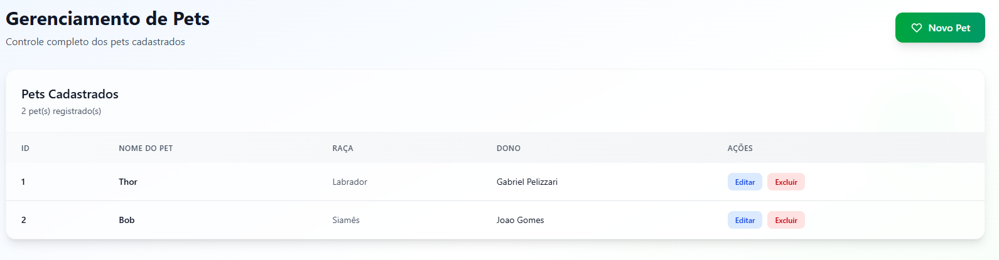
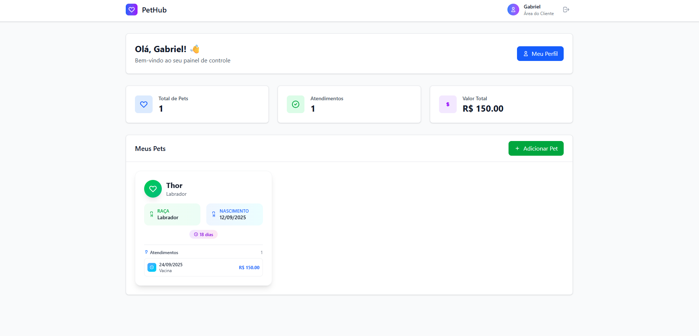

# PetHub – Sistema de Gerenciamento para Petshops

Sistema web full-stack para gestão de petshops, composto por API REST (FastAPI) e interface SPA (Vue.js).

---

## Índice

- [📋 Visão Geral](#-visão-geral)
- [⚡ Funcionalidades](#-funcionalidades)
- [🛠️ Tecnologias Utilizadas](#️-tecnologias-utilizadas)
- [🏗️ Arquitetura](#️-arquitetura)
- [🚀 Como Executar](#-como-executar)
- [📁 Estrutura do Projeto](#-estrutura-do-projeto)
- [👨‍💻 Desenvolvedor](#-desenvolvedor)

---

## 📋 Visão Geral

Sistema completo para gestão de petshops, desenvolvido para automatizar processos operacionais e centralizar informações de clientes, pets e atendimentos.

### Problema resolvido:

- Controle manual de dados em planilhas/cadernos
- Dificuldade para acompanhar histórico de atendimentos
- Falta de visibilidade dos dados do negócio
- Processo de cadastro demorado e propenso a erros
- Dificuldade para clientes acompanharem seus pets

### Solução implementada:

Sistema integrado que automatiza processos, centraliza informações e melhora a experiência de administradores e clientes.

---

## ⚡ Funcionalidades

### **Home**


### **Painel Administrativo**

- ✅ **Dashboard Dinâmico** - Estatísticas em tempo real com dados da API

- ✅ **Gerenciamento de Atendimentos** - Gerenciamento completo de consultas e procedimentos

- ✅ **Gerenciamento de Clientes** - Cadastro completo com dados pessoais e contato

- ✅ **Gerenciamento de Pets/Raças** - Sistema integrado para pets e suas raças



### **Portal do Cliente**

- ✅ **Meus Pets** - Cadastro e gerenciamento completo dos animais
- ✅ **Histórico de Atendimentos** - Visualização detalhada de todos os serviços
- ✅ **Perfil Pessoal** - Gestão de dados e informações de contato



### **Segurança e Validações**

- ✅ **Autenticação JWT** - Sistema seguro de login
- ✅ **Validações Frontend** - Feedback em tempo real com ícones visuais
- ✅ **Validações Backend** - Pydantic com regras de negócio robustas
- ✅ **Proteção de Rotas** - Controle granular de acesso por perfil
- ✅ **Confirmações de Segurança** - Modais de confirmação para ações críticas

---

## 🛠️ Tecnologias Utilizadas

### Backend (Python/FastAPI)

| Tecnologia           | Versão | Descrição                           |
| -------------------- | ------- | ------------------------------------- |
| **Python**     | 3.13+   | Linguagem principal                   |
| **FastAPI**    | Latest  | Framework das APIs                    |
| **SQLAlchemy** | Latest  | ORM para banco de dados               |
| **Pydantic**   | Latest  | Validação e serialização de dados |
| **MySQL**      | -       | Banco de dados relacional             |
| **Uvicorn**    | Latest  | Servidor ASGI                         |
| **JWT**        | Latest  | Autenticação e autorização        |
| **Bcrypt**     | 3.2.0   | Criptografia de senhas                |
| **Pytest**     | 8.4.2+  | Framework de testes                   |

### Frontend (Vue.js/JavaScript)

| Tecnologia             | Versão  | Descrição                  |
| ---------------------- | -------- | ---------------------------- |
| **Vue.js**       | 3.5.18   | Framework JavaScript         |
| **Vite**         | 7.0.6    | Build tool moderna e rápida |
| **Pinia**        | 3.0.3    | Gerenciamento de estado      |
| **Vue Router**   | 4.5.1    | Roteamento SPA               |
| **Axios**        | 1.12.2   | Cliente HTTP                 |
| **Tailwind CSS** | 4.1.13   | Framework CSS utilitário    |
| **Node.js**      | 20.19.0+ | Runtime JavaScript           |

### Ferramentas de Desenvolvimento

- **UV** - Gerenciador de dependências Python moderno
- **ESLint** - Linting JavaScript para qualidade de código
- **Prettier** - Formatação automática de código
- **Git** - Controle de versão distribuído

---

## 🏗️ Arquitetura

### Fluxo de dados

```
Frontend (Vue.js) ↔ API REST (FastAPI) ↔ Banco de Dados (MySQL)
```

### Modelo de dados

```sql
Tabelas principais:
├── usuarios (autenticação - CPF, senha, perfil)
├── clientes (dados pessoais dos clientes)
├── pets (informações dos animais)
├── racas (tipos de raças disponíveis)
├── atendimentos (consultas e procedimentos)
├── enderecos (endereços dos clientes)
└── contatos (emails e telefones)

Relacionamentos:
- usuarios 1:1 clientes (via CPF)
- clientes 1:N pets
- pets N:1 racas
- pets 1:N atendimentos
- clientes 1:1 enderecos
- clientes 1:1 contatos
```

## 🚀 Como Executar

### Pré-requisitos

- **Python 3.13+** instalado
- **Node.js 20.19.0+** instalado
- **UV** (recomendado) ou **Pip**
- **Git** para controle de versão

### Instalação

#### 1. Clone o repositório

```bash
git clone <url-do-repositorio>
cd projeto_petshop
```

#### 2. Backend

##### Opção 1: Usando UV (Recomendado)

```bash
cd backend

# Sincroniza o ambiente virtual e instala as dependências
uv sync

# Ativa o ambiente virtual
source .venv/bin/activate  # Linux/Mac
# .venv\Scripts\activate   # Windows
```

##### Opção 2: Usando Pip e Venv

```bash
cd backend

# Crie e ativa o ambiente virtual
python -m venv .venv
source .venv/bin/activate  # Linux/Mac
# .venv\Scripts\activate   # Windows

# Instala as dependências de produção e desenvolvimento
pip install -e .[dev]
```

# Crie uma copia do arquivo ".env.example" e renomeie para ".env"

Ajuste as variáveis de ambiente do banco de dados mysql local

Ajuste as variáveis de ambiente no arquivo `.env` conforme necessário.

#### Execução dos Comandos

Se estiver usando **UV**, execute os comandos com `uv run`. Se estiver usando **Pip/Venv**, execute os comandos diretamente com `python`.

```bash
# Comando para realizar o migrate das tabelas no banco de dados
# UV: uv run python -m main
# Pip: python -m main

# Comando para criar um usuario administrador
# UV: uv run python scripts/create_user.py
# Pip: python scripts/create_user.py

# Comando para iniciar o servidor
# UV: uv run python -m uvicorn main:app --reload --host 127.0.0.1 --port 8000
# Pip: python -m uvicorn main:app --reload --host 127.0.0.1 --port 8000
```

#### 3. Frontend (novo terminal)

```bash
cd frontend
npm install
npm run dev
```

### **Acesso ao Sistema**

#### **Painel Administrativo**

- **URL:** `http://localhost:5173/dashboard/admin`

#### **Portal do Cliente** 👤

- **Cadastro:** `http://localhost:5173/cadastro`
- **Login:** `http://localhost:5173/login`
- **Dashboard:** `http://localhost:5173/dashboard/cliente`

#### **APIs e Documentação**

- **Backend:** `http://localhost:8000`
- **Documentação:** `http://localhost:8000/docs`

### **Testes**

Os testes podem ser executados com `uv run` ou diretamente se o `pytest` estiver no seu ambiente virtual.

```bash
# Acessar a pasta do backend
cd backend

# Rodar os testes
# Com UV: uv run pytest -v
# Com Pip: pytest -v

# Rodar com cobertura de testes
# Com UV: uv run pytest --cov=app --cov-report=html
# Com Pip: pytest --cov=app --cov-report=html
```

---

## 📁 Estrutura do Projeto

```
projeto_petshop/
├── 📂 backend/                    # API Backend (FastAPI)
│   ├── 📂 app/                   # Código principal da aplicação
│   │   ├── 📂 api/               # Endpoints da API
│   │   │   ├── 📄 deps.py        # Dependências de autenticação
│   │   │   ├── 📄 auth.py        # Autenticação JWT
│   │   │   ├── 📄 usuarios.py    # API de usuarios
│   │   │   ├── 📄 clientes.py    # API de clientes
│   │   │   ├── 📄 pets.py        # API de pets
│   │   │   ├── 📄 racas.py       # API de raças
│   │   │   ├── 📄 atendimentos.py # API de atendimentos
│   │   │   ├── 📄 contatos.py    # API de contatos
│   │   │   ├── 📄 enderecos.py   # API de endereços
│   │   │   └── 📄 cadastro.py    # API de cadastro
│   │   ├── 📂 core/              # Configurações centrais
│   │   │   ├── 📄 config.py      # Configurações do sistema
│   │   │   ├── 📄 database.py    # Conexão com banco de dados
│   │   │   └── 📄 security.py    # Segurança e JWT
│   │   ├── 📂 models/            # Modelos SQLAlchemy
│   │   │   └── 📄 models.py      # Definições das tabelas
│   │   ├── 📂 schemas/           # Schemas Pydantic
│   │   │   ├── 📄 usuario.py     # Validações de usuário
│   │   │   ├── 📄 cliente.py     # Validações de cliente
│   │   │   ├── 📄 pet.py         # Validações de pet
│   │   │   ├── 📄 raca.py        # Validações de raça
│   │   │   ├── 📄 atendimento.py # Validações de atendimento
│   │   │   ├── 📄 endereco.py    # Validações de endereço
│   │   │   ├── 📄 contato.py     # Validações de contato
│   │   │   ├── 📄 cadastro.py    # Validações de cadastro
│   │   │   ├── 📄 token.py       # Validações de tokens JWT
│   │   │   └── 📄 __init__.py 
│   │   └── 📂 services/          # Lógica de negócio
│   │       ├── 📄 usuario_service.py
│   │       ├── 📄 cliente_service.py
│   │       ├── 📄 pet_service.py
│   │       ├── 📄 raca_service.py
│   │       ├── 📄 atendimento_service.py
│   │       ├── 📄 contato_service.py
│   │       └── 📄 endereco_service.py
│   ├── 📂 scripts/               # Scripts utilitários
│   │   └── 📄 create_user.py    # Criação de usuários admin
│   │   └── 📄 seed_racas.py     # Criação de raças
│   ├── 📂 tests/                 # Testes automatizados
│   │   ├── 📄 __init__.py
│   │   ├── 📄 conftest.py
│   │   ├── 📄 test_auth.py
│   │   ├── 📄 test_clientes.py
│   │   ├── 📄 test_pets.py
│   │   ├── 📄 test_racas.py
│   │   └── 📄 test_atendimentos.py
│   ├── 📄 main.py               # Ponto de entrada da API
│   ├── 📄 pyproject.toml        # Dependências Python
│   ├── 📄 .env.example          # Exemplo de variáveis de ambiente
│   ├── 📄 pytest.ini            # Configuração dos testes
│   └── 📄 readme_testes.md      # Documentação específica dos testes
│
├── 📂 frontend/                  # Interface Web (Vue.js)
│   ├── 📂 src/                  # Código fonte
│   │   ├── 📂 assets/           # Recursos estáticos
│   │   │   └── 📄 logo.svg      # Logo da aplicação
│   │   ├── 📂 components/        # Componentes reutilizáveis
│   │   │   ├── 📄 ConfirmationContainer.vue
│   │   │   ├── 📄 ConfirmationModal.vue
│   │   │   ├── 📄 ErrorMessage.vue
│   │   │   ├── 📄 ErrorMessageContainer.vue
│   │   │   ├── 📄 SuccessMessage.vue
│   │   │   └── 📄 SuccessMessageContainer.vue
│   │   ├── 📂 composables/       # Lógica reutilizável
│   │   │   ├── 📄 useSuccessMessage.js
│   │   │   ├── 📄 useErrorMessage.js
│   │   │   ├── 📄 useConfirmationMessage.js
│   │   │   ├── 📄 useCpfFormatter.js
│   │   │   ├── 📄 usePhoneFormatter.js
│   │   │   ├── 📄 useCurrencyFormatter.js
│   │   │   └── 📄 useCharacterOnlyFormatter.js
│   │   ├── 📂 stores/            # Gerenciamento de estado
│   │   │   └── 📄 auth.js       # Store de autenticação
│   │   ├── 📂 services/          # Serviços HTTP
│   │   │   └── 📄 api.js        # Cliente Axios (Comunicação com a API Backend)
│   │   ├── 📂 router/            # Configuração de rotas
│   │   │   └── 📄 index.js      # Definições das rotas
│   │   ├── 📂 views/             # Páginas da aplicação
│   │   │   ├── 📄 HomeView.vue   # Página inicial
│   │   │   ├── 📄 LoginView.vue  # Tela de login
│   │   │   ├── 📄 CadastroView.vue # Tela de cadastro
│   │   │   ├── 📄 DashboardView.vue # Dashboard principal
│   │   │   ├── 📂 admin/         # Painel administrativo
│   │   │   │   ├── 📄 AdminLayout.vue
│   │   │   │   ├── 📂 dashboard/ # Dashboard admin
│   │   │   │   │   └── 📄 AdminOverview.vue
│   │   │   │   ├── 📂 clientes/  # Gerenciamento de clientes
│   │   │   │   │   ├── 📄 ClienteList.vue
│   │   │   │   │   ├── 📄 ClienteCreate.vue
│   │   │   │   │   ├── 📄 ClienteEdit.vue
│   │   │   │   │   └── 📄 ClienteDetail.vue
│   │   │   │   ├── 📂 pets/      # Gerenciamento de pets
│   │   │   │   │   └── 📄 PetList.vue
│   │   │   │   ├── 📂 racas/     # Gerenciamento de raças
│   │   │   │   │   └── 📄 RacaList.vue
│   │   │   │   └── 📂 atendimentos/ # Gerenciamento de atendimentos
│   │   │   │       └── 📄 AtendimentosAdmin.vue
│   │   │   └── 📂 cliente/       # Portal do cliente
│   │   │       ├── 📂 dashboard/ # Dashboard cliente
│   │   │       │   └── 📄 DashboardCliente.vue
│   │   │       └── 📂 components/ # Componentes do cliente
│   │   │           ├── 📄 PetCard.vue
│   │   │           ├── 📄 AddPetForm.vue
│   │   │           ├── 📄 AtendimentoCard.vue
│   │   │           └── 📄 ClientProfile.vue
│   │   ├── 📄 App.vue           # Componente raiz
│   │   └── 📄 main.js          # Ponto de entrada
│   ├── 📄 index.html           # Template HTML
│   ├── 📄 package.json         # Dependências Node.js
│   ├── 📄 vite.config.js       # Configuração Vite
│   ├── 📄 tailwind.config.js   # Configuração Tailwind
│   └── 📄 jsconfig.json        # Configuração JavaScript
│
├── 📄 README.md                # Documentação do projeto
├── 📄 .gitignore              # Arquivos ignorados pelo Git
├── 📄 .gitattributes          # Configuração do Git
```

---

## 👨‍💻 Desenvolvedor

**Gabriel Pelizzari**
*Desenvolvedor Full Stack*
